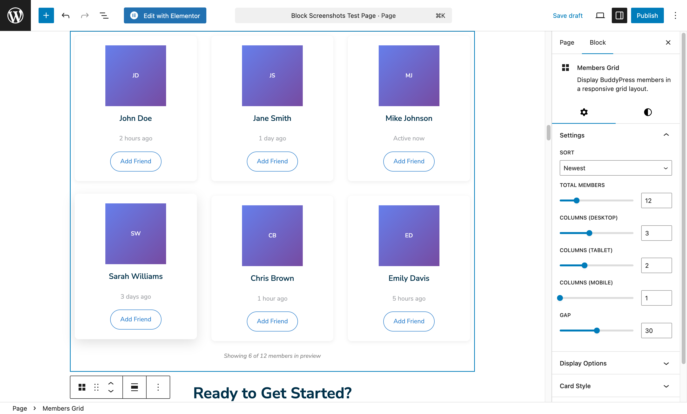
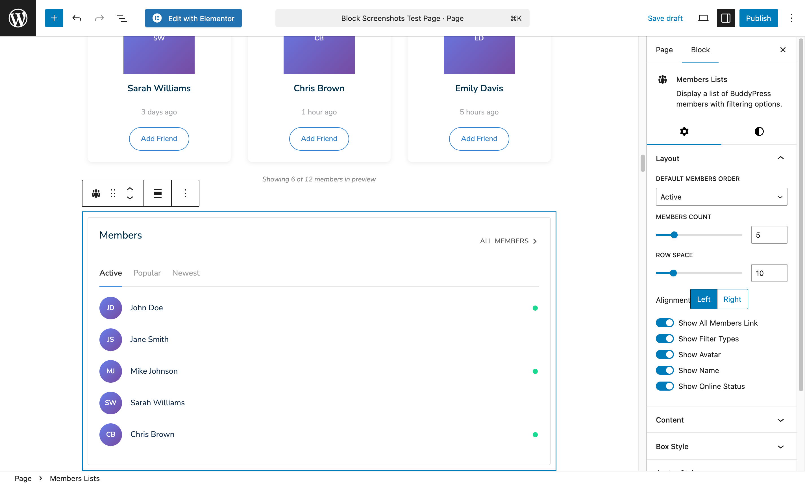
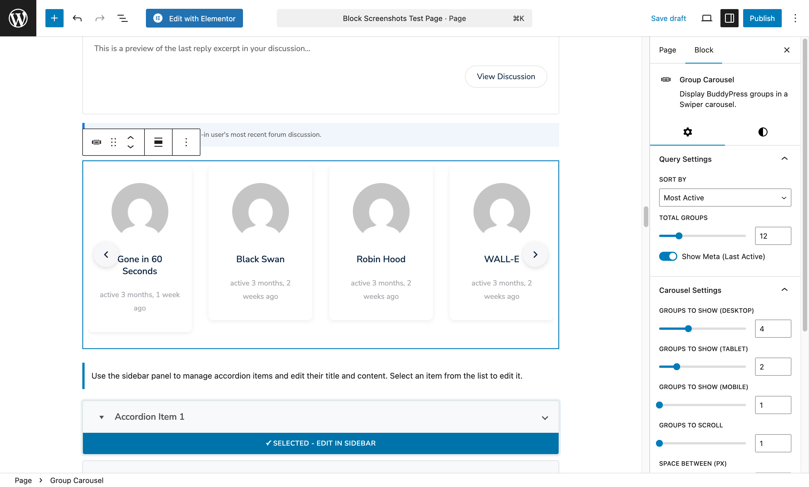
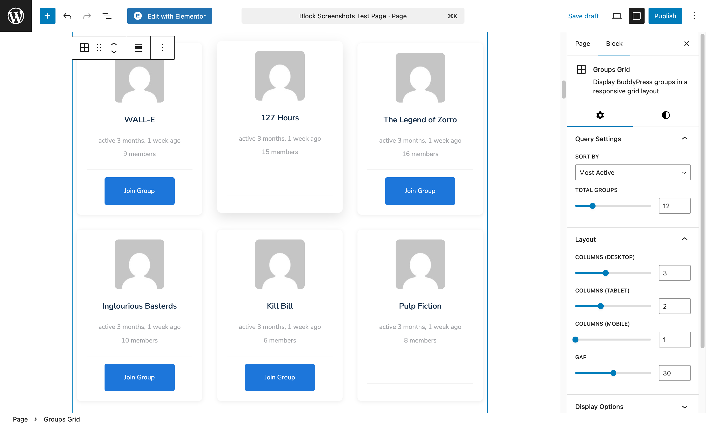
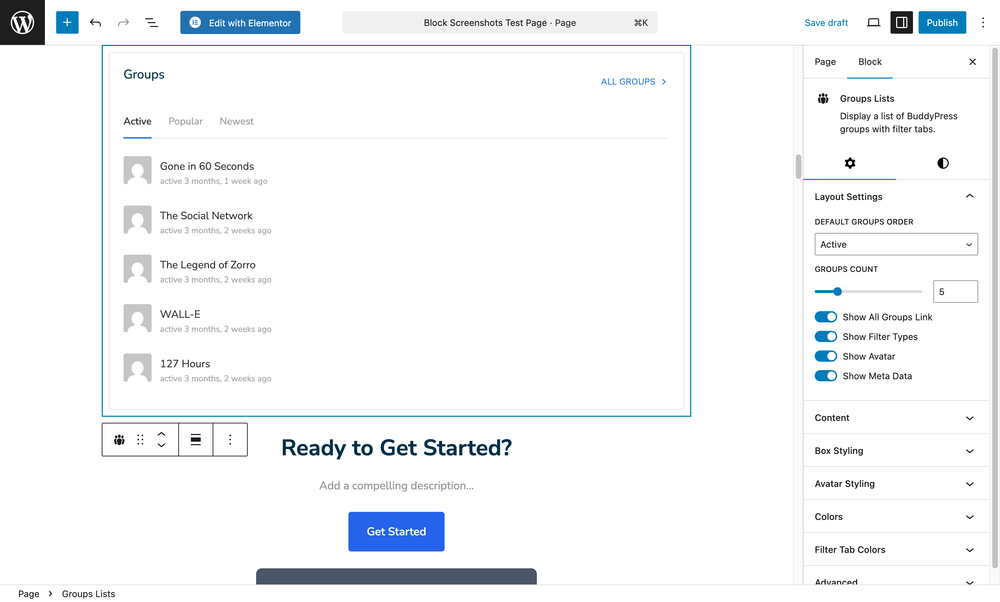
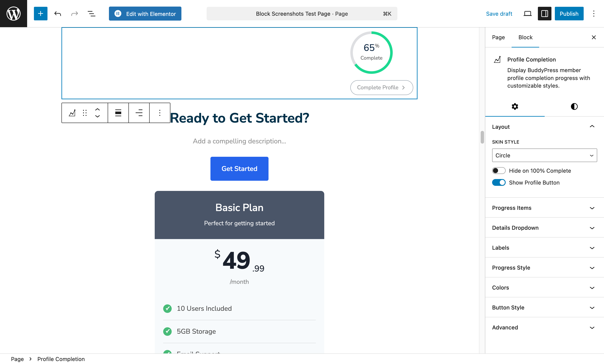
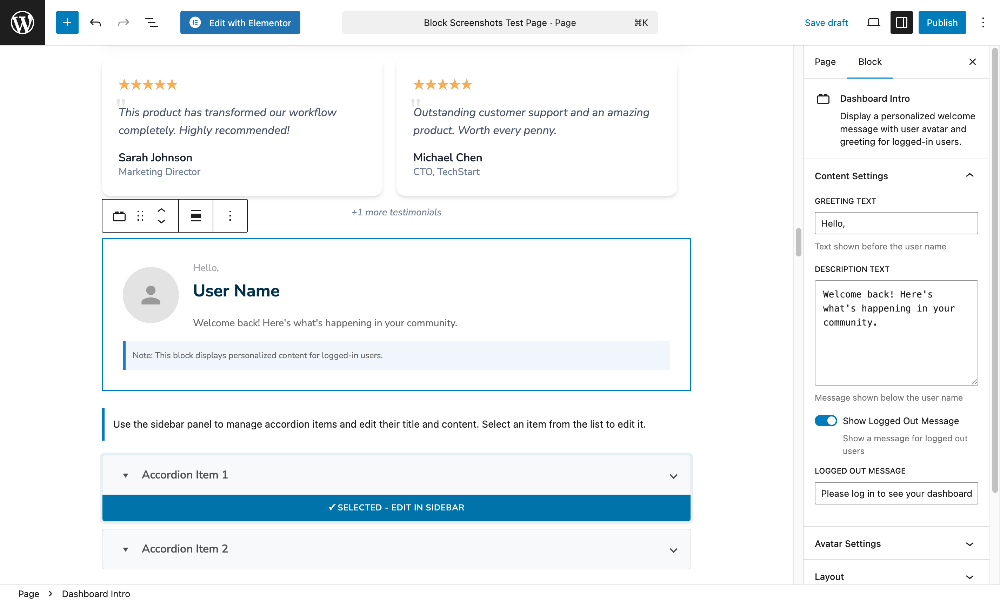
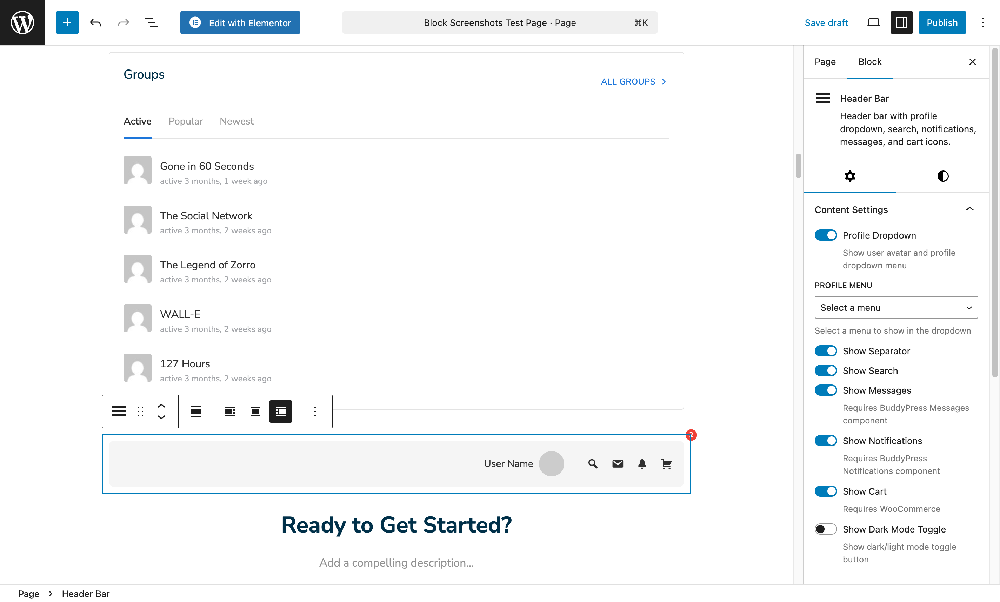
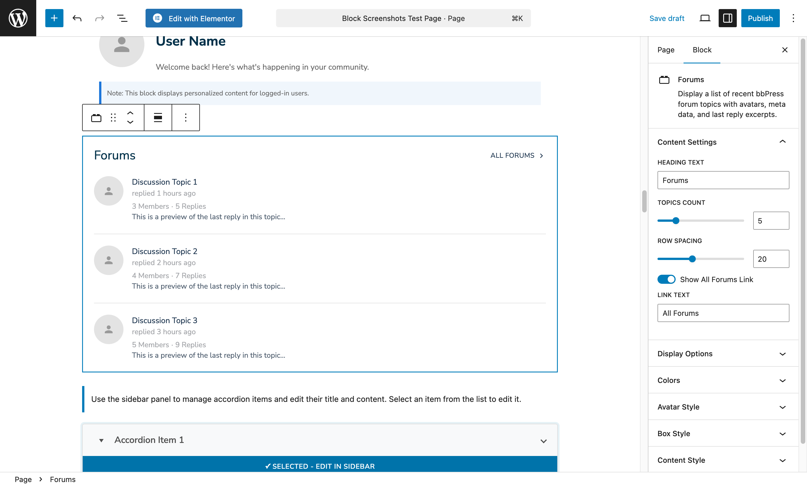
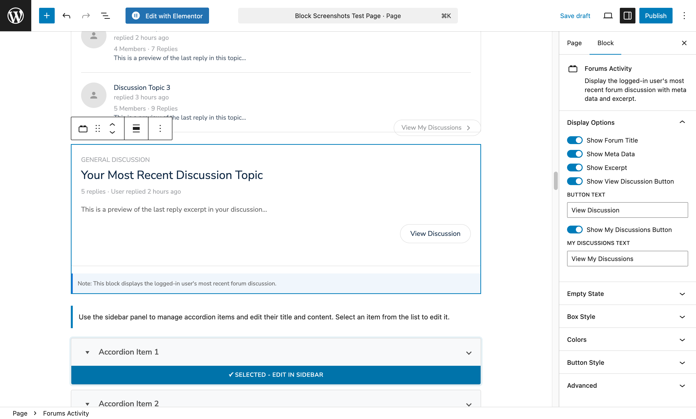

# BuddyPress Blocks

11 blocks for building community features. **Requires BuddyPress plugin to be active.**

> These blocks only appear in the block inserter when BuddyPress is installed and activated.

---

## Members Carousel

Display community members in a sliding carousel.


### What You Can Do

- Show members in attractive carousel
- Display avatar, name, and meta info
- Filter by member type
- Link directly to profiles

### Settings

| Setting | Options | Recommended |
|---------|---------|-------------|
| Members Count | Number | 12 |
| Member Type | All, Active, Popular, Newest | Active |
| Per View | 1-6 | 4 |
| Show Name | Yes/No | Yes |
| Show Meta | Yes/No | Yes |
| Autoplay | Yes/No | Yes |
| Loop | Yes/No | Yes |

### Best For

- Homepage "Active Members" section
- Community showcase
- "Meet Our Members" sections

---

## Members Grid

Display members in grid layout with optional filters.



### What You Can Do

- Show members in organized grid
- Enable search and filters
- Pagination for large communities
- Customize card appearance

### Settings

| Setting | Options |
|---------|---------|
| Columns | 2-6 |
| Members Per Page | Number |
| Member Type | Filter by type |
| Show Search | Yes/No |
| Show Filters | Yes/No |
| Card Style | Default, Minimal |

### Best For

- Member directory pages
- Community browsing
- Full member listings

---

## Members Lists

Compact member listing format.



### What You Can Do

- Display members in list view
- Show more info per member
- Compact for sidebars
- Quick profile access

### Settings

| Setting | Options |
|---------|---------|
| Members Count | Number |
| Member Type | Filter |
| Show Avatar | Yes/No |
| Show Role | Yes/No |
| Avatar Size | Small, Medium |

### Best For

- Sidebar widgets
- Recent members lists
- Compact member displays

---

## Group Carousel

Display BuddyPress groups in carousel.



### What You Can Do

- Showcase groups in sliding format
- Show group avatar and info
- Display member count
- Filter by group status

### Settings

| Setting | Options |
|---------|---------|
| Groups Count | Number |
| Group Type | All, Public, Private |
| Per View | 1-6 |
| Show Description | Yes/No |
| Show Member Count | Yes/No |
| Autoplay | Yes/No |

### Best For

- Homepage group showcase
- "Popular Groups" section
- Group discovery

---

## Groups Grid

Display groups in grid layout.



### What You Can Do

- Show groups in organized grid
- Filter by group type
- Pagination support
- Card styling options

### Settings

| Setting | Options |
|---------|---------|
| Columns | 2-4 |
| Groups Per Page | Number |
| Group Type | Public, Private, All |
| Show Description | Yes/No |
| Card Style | Default, Minimal |

### Best For

- Group directory pages
- Community exploration
- Group listings

---

## Groups Lists

Compact group listing.



### What You Can Do

- List groups compactly
- Show key group info
- Quick join buttons
- Sidebar-friendly

### Settings

| Setting | Options |
|---------|---------|
| Groups Count | Number |
| Show Avatar | Yes/No |
| Show Members | Yes/No |
| Show Join Button | Yes/No |

### Best For

- Sidebar group lists
- Recent groups
- Quick group access

---

## Profile Completion

Show users their profile completion progress.



### What You Can Do

- Display profile completion percentage
- Show which fields are missing
- Encourage profile completion
- Link to profile edit

### Settings

| Setting | Options |
|---------|---------|
| Show Percentage | Yes/No |
| Show Progress Bar | Yes/No |
| Show Missing Fields | Yes/No |
| Edit Profile Link | Yes/No |

### Best For

- Member dashboard
- Profile page sidebar
- New member onboarding

---

## Dashboard Intro

Welcome panel for logged-in users.



### What You Can Do

- Personalized welcome message
- Show user's avatar
- Quick action links
- Custom greeting text

### Settings

| Setting | Options |
|---------|---------|
| Greeting | Text |
| Show Avatar | Yes/No |
| Show Name | Yes/No |
| Quick Links | Add multiple |
| Message | Welcome text |

### Best For

- Member homepages
- Dashboard welcome section
- Personalized community greeting

---

## Header Bar

Navigation bar with BuddyPress features.



### What You Can Do

- Show notifications dropdown
- Show messages dropdown
- User profile menu
- Friend requests

### Settings

| Setting | Options |
|---------|---------|
| Show Notifications | Yes/No |
| Show Messages | Yes/No |
| Show Friends | Yes/No |
| Show Search | Yes/No |
| User Menu | Customize |

### Best For

- Site header
- Community navigation
- Member area top bar

---

## Forums

Display bbPress forums list.



### What You Can Do

- List all forum categories
- Show topic and reply counts
- Display latest activity
- Link to forum pages

### Settings

| Setting | Options |
|---------|---------|
| Forum Layout | List, Grid |
| Show Counts | Yes/No |
| Show Latest | Yes/No |
| Forums | All or Select |

### Best For

- Community homepage
- Forum directory
- Discussion overview

---

## Forums Activity

Show recent forum activity feed.



### What You Can Do

- Display recent topics and replies
- Show activity timestamp
- Link to discussions
- Filter by forum

### Settings

| Setting | Options |
|---------|---------|
| Activity Count | Number |
| Show Author | Yes/No |
| Show Forum | Yes/No |
| Show Time | Yes/No |

### Best For

- Community homepage
- Sidebar activity feed
- Recent discussions

---

## Building a Community Homepage

### Recommended Layout

```
[Dashboard Intro] - Welcome logged-in users

[Members Carousel] - "Active Members"

[Groups Grid] - "Popular Groups"

[Forums Activity] - "Recent Discussions"

[CTA Box] - "Join our community today!"
```

---

[Back to All Blocks](./index.md) | [Next: WooCommerce Blocks](./woocommerce.md)
