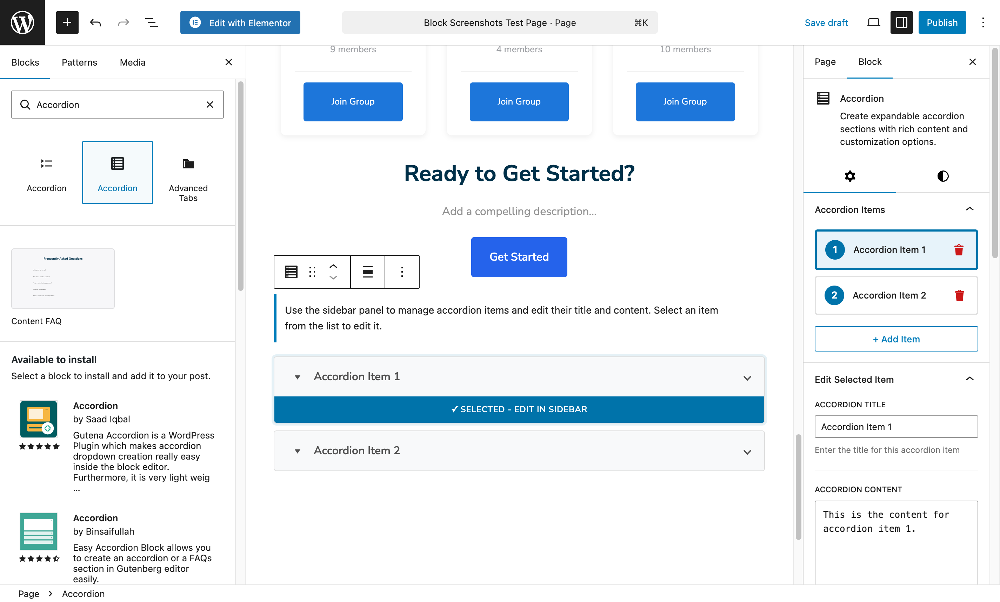
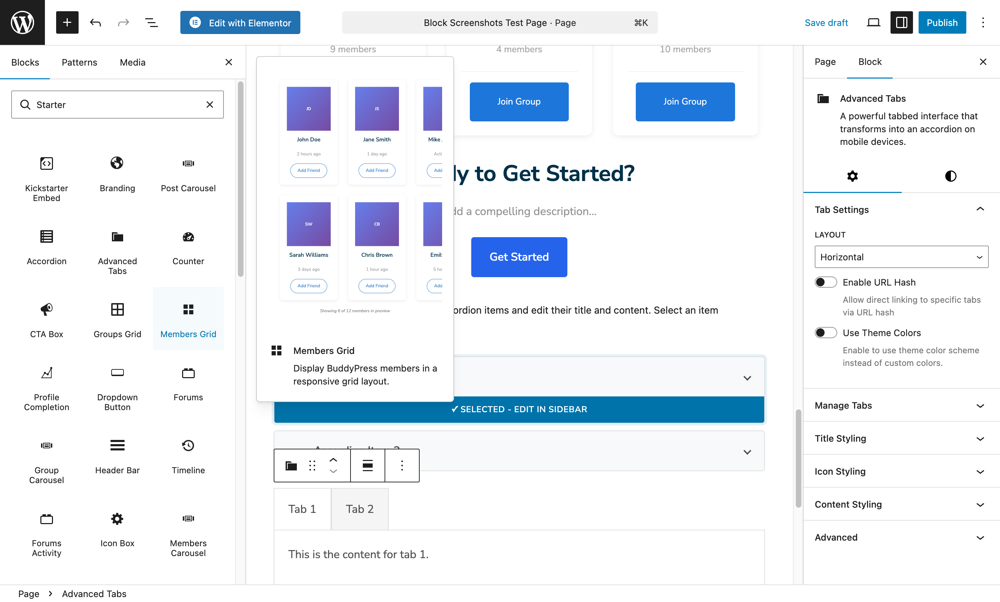
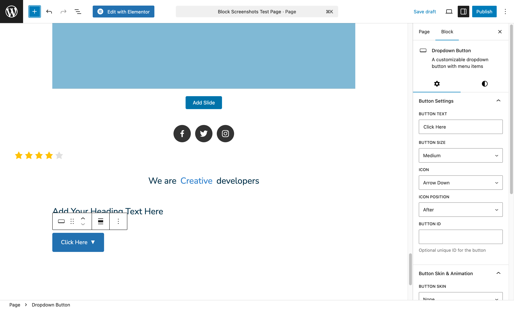
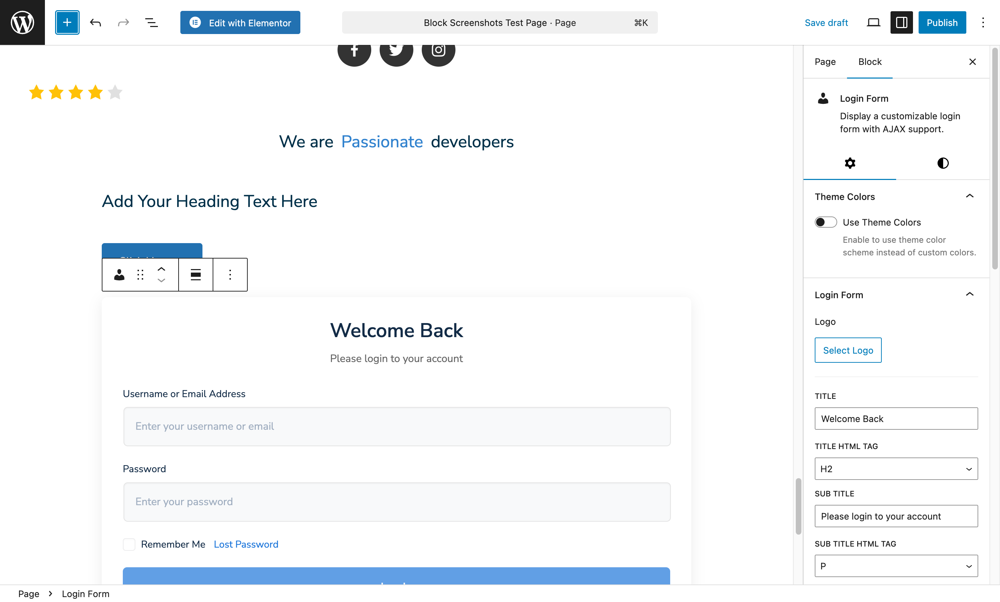
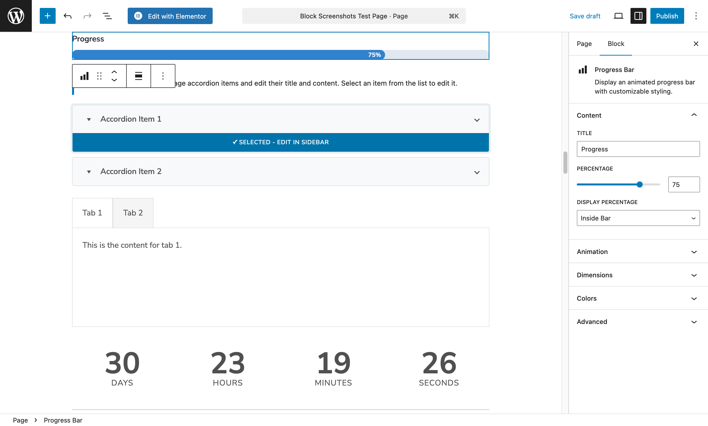
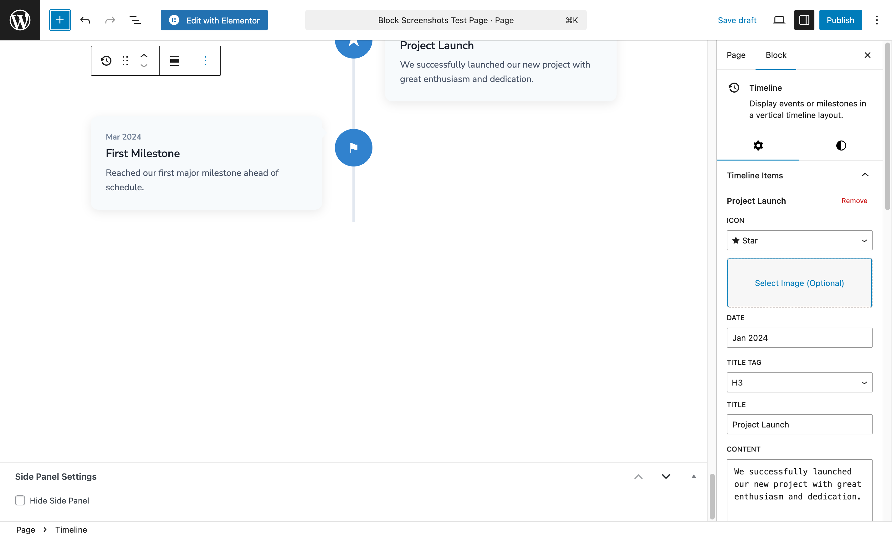
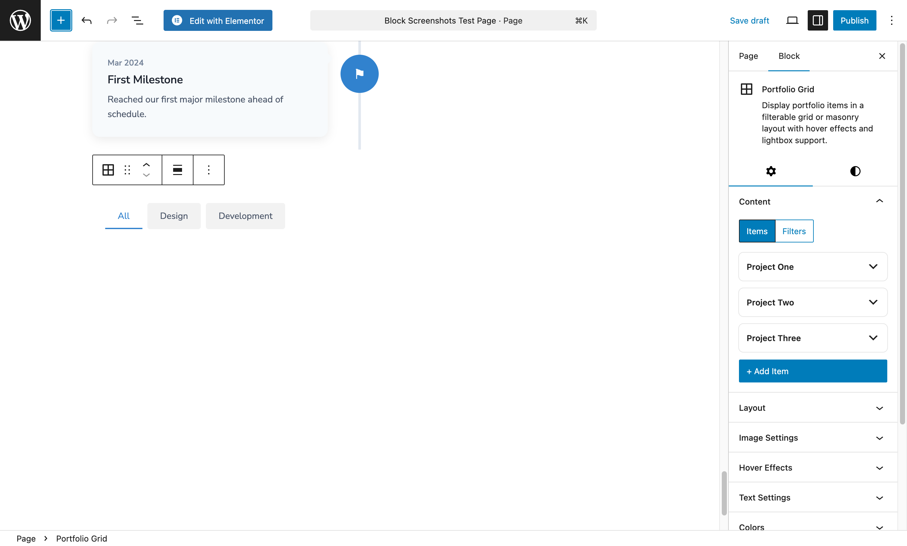

# Content Blocks

8 blocks for organizing and presenting your content with interactive elements like tabs, accordions, and timelines.

---

## Accordion

Collapsible content panels - perfect for FAQs.

### What You Can Do

- Add unlimited collapsible sections
- Choose to allow one or multiple sections open
- Add icons (arrow or plus/minus style)
- Enable FAQ schema for SEO

### Settings

| Setting | Options | Recommended |
|---------|---------|-------------|
| Items | Add multiple | 5-10 for FAQs |
| Icon Position | Left, Right | Right |
| Icon Style | Arrow, Plus/Minus | Arrow |
| Allow Multiple Open | Yes/No | No |
| First Open | Yes/No | Yes |
| FAQ Schema | Yes/No | Yes for FAQs |

### Best For

- FAQ sections
- Feature explanations
- Documentation
- Product specifications

### Pro Tip

Enable FAQ Schema for better Google search results - your questions may appear directly in search!

---

## Advanced Tabs

Organize content into tabbed panels.

### What You Can Do

- Create unlimited tabs
- Add icons to tab titles
- Position tabs top, left, or right
- Style active tab differently

### Settings

| Setting | Options |
|---------|---------|
| Tabs | Add multiple |
| Tab Title | Text |
| Tab Icon | Optional icon |
| Tab Position | Top, Left, Right |
| Icon Position | Before text, After text |

### Best For

- Product details (Description, Specs, Reviews)
- Pricing plan comparisons
- Feature categories
- Step-by-step guides

---

## Dropdown Button

Button that reveals a dropdown menu.

### What You Can Do

- Add button with dropdown menu
- Trigger on hover or click
- Include icons in menu items
- Style button and dropdown

### Settings

| Setting | Options |
|---------|---------|
| Button Text | Text |
| Button Icon | Optional |
| Menu Items | Add multiple |
| Trigger | Hover, Click |
| Animation | Fade, Slide |

### Best For

- Action menus ("More options")
- Filter buttons
- User account menus

---

## Login Form

User login and registration form.

### What You Can Do

- Display login form for visitors
- Show "Remember Me" option
- Include lost password link
- Redirect after successful login

### Settings

| Setting | Options |
|---------|---------|
| Remember Me | Show/Hide |
| Lost Password Link | Show/Hide |
| Redirect URL | Custom URL |
| Registration Link | Show/Hide |
| Button Text | Customizable |

### Best For

- Member login pages
- Gated content access
- Sidebar login widgets

---

## Progress Bar

Animated progress indicator.

### What You Can Do

- Show percentage progress
- Add title label
- Enable animated stripes
- Animate on scroll

### Settings

| Setting | Options |
|---------|---------|
| Percentage | 0-100 |
| Title | Text |
| Show Percentage | Inside, Outside, Hide |
| Striped | Yes/No |
| Animate on Scroll | Yes/No |

### Best For

- Skill displays
- Goal progress ("75% funded!")
- Completion status
- Crowdfunding campaigns

---

## Timeline

Vertical timeline for showing history or steps.

### What You Can Do

- Add unlimited timeline items
- Include date, title, content, icon
- Alternate items left and right
- Style connecting line

### Settings

| Setting | Options |
|---------|---------|
| Items | Add multiple |
| Date Format | Customizable |
| Alternating | Yes/No |
| Line Style | Solid, Dashed |
| Icon Style | Circle, Square |

### Best For

- Company history
- Project milestones
- Event schedules
- Process steps ("How it works")

---

## CTA Box

Call-to-action box to drive conversions.

### What You Can Do

- Create attention-grabbing CTA sections
- Add heading, description, and button
- Choose horizontal or stacked layout
- Style background and button

### Settings

| Setting | Options |
|---------|---------|
| Heading | Text |
| Description | Text |
| Button Text | Text |
| Button Link | URL |
| Layout | Horizontal, Stacked |
| Background | Color/Gradient |

### Best For

- Newsletter signups
- Product promotions
- Next step prompts
- "Ready to get started?" sections

### Pro Tip

Place CTA boxes at the end of important pages and after testimonials for best conversion rates.

---

## Portfolio Grid

Display portfolio items in a filterable grid.

### What You Can Do

- Show portfolio items in grid layout
- Filter by category
- Add hover effects
- Open items in lightbox

### Settings

| Setting | Options |
|---------|---------|
| Columns | 1-6 |
| Category Filter | Show/Hide |
| Hover Effect | Fade, Zoom, Slide |
| Lightbox | Yes/No |
| Show Title | Yes/No |
| Pagination | Yes/No |

### Best For

- Design portfolios
- Photography galleries
- Project showcases
- Case studies

---

[Back to All Blocks](./index.md) | [Next: Blog Blocks](./blog.md)
