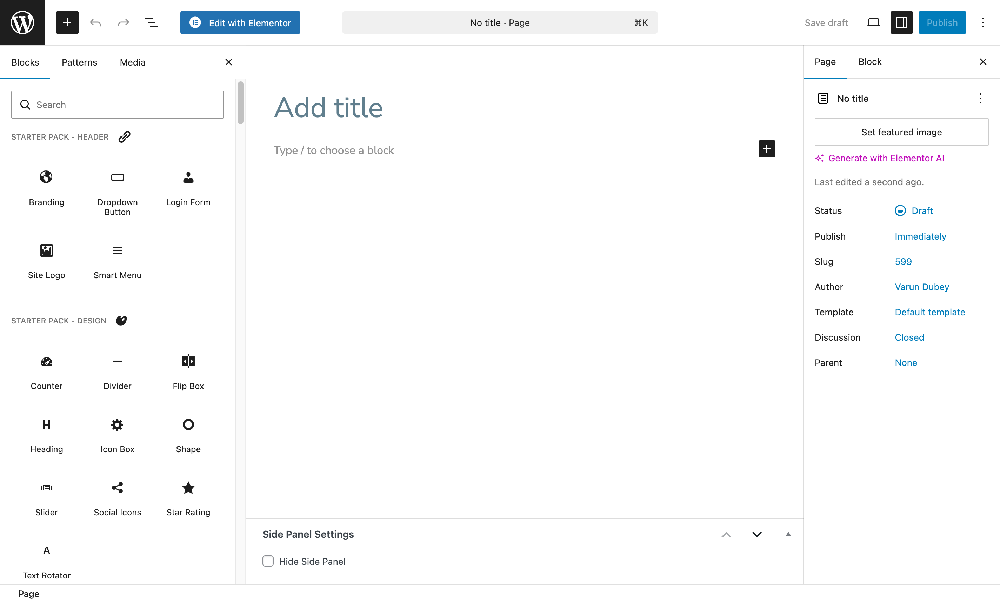
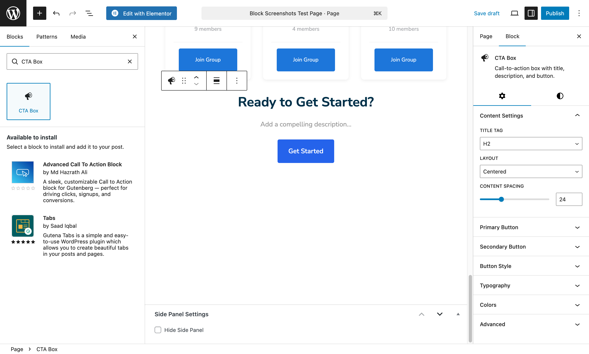

# Gutenberg Blocks

WBcom Essential includes **45 ready-to-use blocks** for the WordPress block editor. No coding required - just drag, drop, and customize!

---

## Block Categories

| Category | Blocks | Best For |
|----------|--------|----------|
| [Header Blocks](./header.md) | 4 | Site navigation and branding |
| [Design Blocks](./design.md) | 12 | Visual elements and layouts |
| [Content Blocks](./content.md) | 8 | Text, tabs, and interactive content |
| [Blog Blocks](./blog.md) | 6 | Displaying your posts |
| [Marketing Blocks](./marketing.md) | 4 | Conversions and sales |
| [BuddyPress Blocks](./buddypress.md) | 11 | Community features |
| [WooCommerce Blocks](./woocommerce.md) | 2 | Online store features |

---

## How to Find Blocks

1. Edit any page in WordPress
2. Click the **+** button to add a block
3. Search for "Starter Pack" or the block name
4. Drag the block onto your page

---

## Settings Every Block Has

### Theme Colors Toggle

**Location**: Block Settings > Color Settings > Use Theme Colors

When enabled, your blocks automatically match your theme's colors. Change your theme colors once, and all blocks update automatically!

*Example: CTA Box block with settings panel visible*

### Spacing Controls

- **Margin**: Space outside the block
- **Padding**: Space inside the block

### Responsive Preview

Click the device icons in the editor toolbar to preview how your blocks look on desktop, tablet, and mobile.

---

## Quick Tips

1. **Enable Theme Colors** - Keeps your site looking consistent
2. **Preview on mobile** - Always check mobile view before publishing
3. **Use categories** - Find blocks faster by browsing categories
4. **Copy blocks** - Right-click any block to duplicate it

---

## Browse by Category

- [Header Blocks](./header.md) - Branding, navigation, user menus
- [Design Blocks](./design.md) - Counters, sliders, icons, shapes
- [Content Blocks](./content.md) - Accordions, tabs, timelines
- [Blog Blocks](./blog.md) - Post carousels, sliders, tickers
- [Marketing Blocks](./marketing.md) - Pricing, CTAs, testimonials
- [BuddyPress Blocks](./buddypress.md) - Members, groups, forums
- [WooCommerce Blocks](./woocommerce.md) - Products, cart

---

## Block Screenshots

All block screenshots are available in `docs/images/blocks/`. Each screenshot shows the block in the WordPress editor with its settings panel visible.

### Header Blocks
| Block | Screenshot |
|-------|------------|
| Branding | [branding-block-editor.png](../images/blocks/branding-block-editor.png) |
| Dropdown Button | [dropdown-button-block-editor.png](../images/blocks/dropdown-button-block-editor.png) |
| Login Form | [login-form-block-editor.png](../images/blocks/login-form-block-editor.png) |
| Site Logo | [site-logo-block-editor.png](../images/blocks/site-logo-block-editor.png) |
| Smart Menu | [smart-menu-block-editor.png](../images/blocks/smart-menu-block-editor.png) |

### Design Blocks
| Block | Screenshot |
|-------|------------|
| Counter | [counter-block-editor.png](../images/blocks/counter-block-editor.png) |
| Divider | [divider-block-editor.png](../images/blocks/divider-block-editor.png) |
| Flip Box | [flip-box-block-editor.png](../images/blocks/flip-box-block-editor.png) |
| Heading | [heading-block-editor.png](../images/blocks/heading-block-editor.png) |
| Icon Box | [icon-box-block-editor.png](../images/blocks/icon-box-block-editor.png) |
| Shape | [shape-block-editor.png](../images/blocks/shape-block-editor.png) |
| Slider | [slider-block-editor.png](../images/blocks/slider-block-editor.png) |
| Social Icons | [social-icons-block-editor.png](../images/blocks/social-icons-block-editor.png) |
| Star Rating | [star-rating-block-editor.png](../images/blocks/star-rating-block-editor.png) |
| Text Rotator | [text-rotator-block-editor.png](../images/blocks/text-rotator-block-editor.png) |

### Content Blocks
| Block | Screenshot |
|-------|------------|
| Accordion | [accordion-block-editor.png](../images/blocks/accordion-block-editor.png) |
| Advanced Tabs | [advanced-tabs-block-editor.png](../images/blocks/advanced-tabs-block-editor.png) |
| Timeline | [timeline-block-editor.png](../images/blocks/timeline-block-editor.png) |

### Blog Blocks
| Block | Screenshot |
|-------|------------|
| Portfolio Grid | [portfolio-grid-block-editor.png](../images/blocks/portfolio-grid-block-editor.png) |
| Post Carousel | [post-carousel-block-editor.png](../images/blocks/post-carousel-block-editor.png) |
| Post Slider | [post-slider-block-editor.png](../images/blocks/post-slider-block-editor.png) |
| Post Timeline | [post-timeline-block-editor.png](../images/blocks/post-timeline-block-editor.png) |
| Posts Carousel | [posts-carousel-block-editor.png](../images/blocks/posts-carousel-block-editor.png) |
| Posts Revolution | [posts-revolution-block.png](../images/blocks/posts-revolution-block.png) |
| Posts Ticker | [posts-ticker-block.png](../images/blocks/posts-ticker-block.png) |

### Marketing Blocks
| Block | Screenshot |
|-------|------------|
| Countdown | [countdown-block-editor.png](../images/blocks/countdown-block-editor.png) |
| CTA Box | [cta-box-block-editor.png](../images/blocks/cta-box-block-editor.png) |
| Pricing Table | [pricing-table-block.png](../images/blocks/pricing-table-block.png) |
| Progress Bar | [progress-bar-block.png](../images/blocks/progress-bar-block.png) |
| Team Carousel | [team-carousel-block.png](../images/blocks/team-carousel-block.png) |
| Testimonial | [testimonial-block.png](../images/blocks/testimonial-block.png) |
| Testimonial Carousel | [testimonial-carousel-block.png](../images/blocks/testimonial-carousel-block.png) |

### BuddyPress Blocks
| Block | Screenshot |
|-------|------------|
| Dashboard Intro | [dashboard-intro-block.png](../images/blocks/dashboard-intro-block.png) |
| Forums | [forums-block.png](../images/blocks/forums-block.png) |
| Forums Activity | [forums-activity-block.png](../images/blocks/forums-activity-block.png) |
| Group Carousel | [group-carousel-block.png](../images/blocks/group-carousel-block.png) |
| Groups Grid | [groups-grid-block.png](../images/blocks/groups-grid-block.png) |
| Groups Lists | [groups-lists-block.png](../images/blocks/groups-lists-block.png) |
| Header Bar | [header-bar-block.png](../images/blocks/header-bar-block.png) |
| Members Carousel | [members-carousel-block.png](../images/blocks/members-carousel-block.png) |
| Members Grid | [members-grid-block.png](../images/blocks/members-grid-block.png) |
| Members Lists | [members-lists-block.png](../images/blocks/members-lists-block.png) |
| Profile Completion | [profile-completion-block.png](../images/blocks/profile-completion-block.png) |

### WooCommerce Blocks
| Block | Screenshot |
|-------|------------|
| Product Grid | [product-grid-block.png](../images/blocks/product-grid-block.png) |
| Mini Cart | [mini-cart-block.png](../images/blocks/mini-cart-block.png) |
