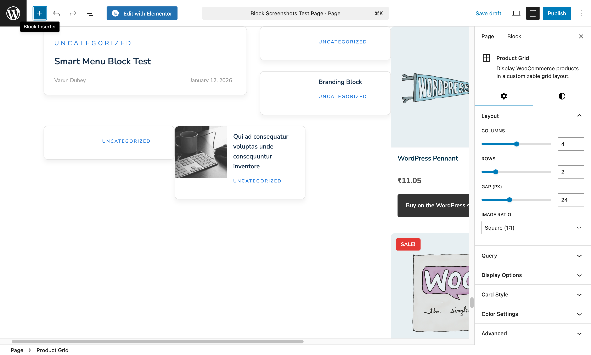
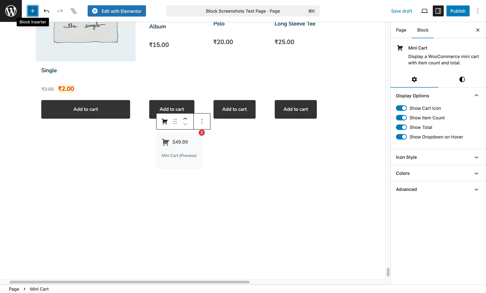

# WooCommerce Blocks

2 specialized blocks for e-commerce features. **Requires WooCommerce plugin to be active.**

> These blocks only appear in the block inserter when WooCommerce is installed and activated.

---

## Product Grid

Display WooCommerce products in customizable grid.



### What You Can Do

- Show products in attractive grid
- Filter by category, tag, or featured
- Display sale badges
- Add to cart buttons
- Show ratings and prices

### Settings

| Setting | Options | Recommended |
|---------|---------|-------------|
| Columns | 2-6 | 4 |
| Products Per Page | Number | 8-12 |
| Filter By | Category, Tag, Featured, On Sale | Your choice |
| Show Image | Yes/No | Yes |
| Show Title | Yes/No | Yes |
| Show Price | Yes/No | Yes |
| Show Rating | Yes/No | Yes |
| Show Add to Cart | Yes/No | Yes |
| Show Sale Badge | Yes/No | Yes |
| Order By | Date, Price, Popularity, Rating | Popularity |

### Best For

- Homepage featured products
- Category landing pages
- Sale product showcases
- New arrivals sections

### Use Cases

**Featured Products Section**
```
Filter: Featured Products
Columns: 4
Products: 8
Show: Image, Title, Price, Add to Cart
```

**Sale Products Banner**
```
Filter: On Sale
Columns: 4
Products: 8
Show Sale Badge: Yes
```

**New Arrivals**
```
Filter: All Products
Order By: Date (newest)
Products: 4
```

---

## Mini Cart

Shopping cart icon with dropdown preview.



### What You Can Do

- Show cart icon in header
- Display item count badge
- Dropdown cart preview
- Quick checkout link
- Show cart total

### Settings

| Setting | Options | Recommended |
|---------|---------|-------------|
| Show Count | Yes/No | Yes |
| Show Total | Yes/No | Yes |
| Icon Style | Cart, Bag, Basket | Cart |
| Dropdown | Yes/No | Yes |
| Dropdown Shows | Items, Total, Checkout Button | All |

### Best For

- Site header (use with Header Bar)
- Navigation bar
- Sticky header

### Pro Tips

1. **Always show count** - Users want to know what's in their cart
2. **Enable dropdown** - Let users preview without leaving the page
3. **Include checkout link** - Easy path to purchase

---

## Building E-commerce Pages

### Homepage Product Section

```
[Heading: "Featured Products"]

[Product Grid]
- Filter: Featured
- Columns: 4
- Products: 8

[CTA Box: "View All Products →"]
```

### Category Landing Page

```
[Category Hero Image]

[Product Grid]
- Filter: Specific Category
- Columns: 4
- Products: 12
- Show Pagination: Yes
```

### Sale Page

```
[Countdown: "Sale Ends In..."]

[Product Grid]
- Filter: On Sale
- Show Sale Badge: Yes
- Order By: Discount Amount
```

---

## Combining with Header Bar

For the best e-commerce header experience, combine Mini Cart with Header Bar:

**Header Bar Settings:**
- Show Search: Yes
- Show Cart: Yes (uses Mini Cart)
- Show User Menu: Yes

This gives customers:
- Easy product search
- Cart preview
- Account access

---

## Why Only 2 WooCommerce Blocks?

WooCommerce itself provides excellent native blocks for:
- Product details
- Product reviews
- Cart and checkout
- Account pages

We focused on blocks that enhance WooCommerce where native blocks don't exist:
- **Product Grid** - More styling control than native WC blocks
- **Mini Cart** - Header integration with dropdown preview

---

[Back to All Blocks](./index.md) | [View All Widgets](../widgets/index.md)
